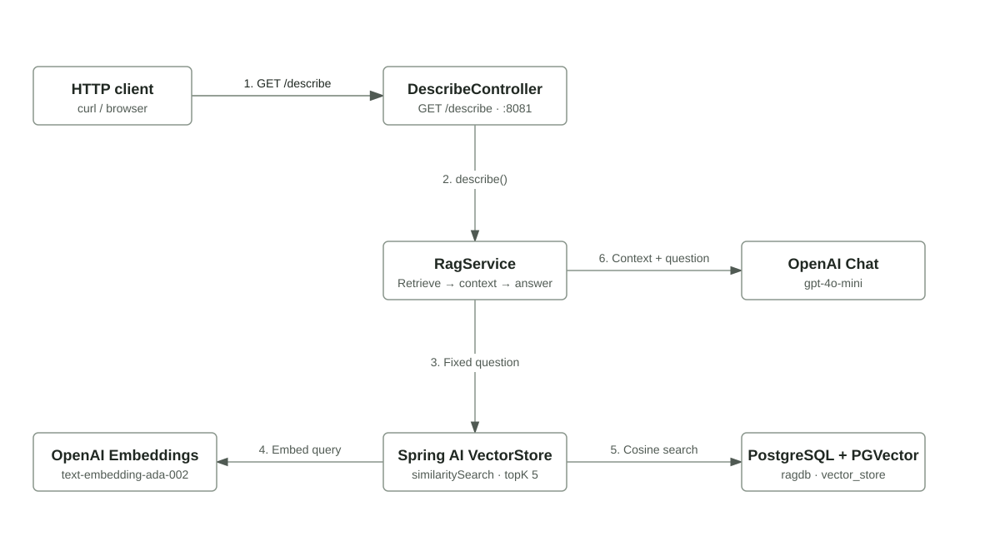

# Spring AI Showcase

A simple project demonstrating **Retrieval-Augmented Generation (RAG)** using:
- **Spring Boot 4.0.6** / Java 23
- **Spring AI 2.0.0-M6**
- **PGVector** as the vector database
- **OpenAI** for embeddings (`text-embedding-ada-002`) and chat (`gpt-4o-mini`)

---

## Interactive architecture diagram

Follow a `GET /describe` request through Spring AI, PGVector, and OpenAI:

[](https://github.com/HendrikD2005/SpringAI-Showcase/raw/refs/heads/feature/archify/docs/architecture/describe.html)

**[Download the interactive chart](https://github.com/HendrikD2005/SpringAI-Showcase/raw/refs/heads/feature/archify/docs/architecture/describe.html)**
and open the HTML file in your browser. Select **Runthrough → Play** for a
40-second animated walkthrough of the request and response. **Pause**, **Resume**,
**Stop**, and **Replay** let you control playback. Select components to read their
details and source code; zoom, light/dark themes, and SVG export are also available.

GitHub displays the preview above as a static image; the interactive player runs
in the downloaded HTML. It works offline without an API key or a running application.
Source-code links require an internet connection.

See [architecture documentation](docs/architecture/README.md) for regeneration commands.

## How RAG works in this project

```
              ┌─────────────────── STARTUP (once) ───────────────────────┐
              │  TIOBE.pdf  ──►  PagePdfDocumentReader                   │
              │                        │                                  │
              │                 TokenTextSplitter (chunks)               │
              │                        │                                  │
              │              OpenAI Embeddings API                       │
              │                        │                                  │
              │                   PGVector DB  ◄────────────────────────  │
              └───────────────────────────────────────────────────────── ┘

              ┌─────────────────── GET /describe ────────────────────────┐
              │  Query ──► Embedding ──► Similarity Search (PGVector)    │
              │                              │                            │
              │                     Top-5 chunks (context)              │
              │                              │                            │
              │                    OpenAI Chat API (gpt-4o-mini)        │
              │                              │                            │
              │                         Response (JSON)                  │
              └───────────────────────────────────────────────────────── ┘
```

---

## Setup

### 1. Add TIOBE.pdf

Place the PDF file at:
```
src/main/resources/TIOBE.pdf
```

### 2. Set your OpenAI API key

```bash
cp .env.example .env
# Edit .env and insert your key: OPENAI_API_KEY=sk-...
```

### 3. Start with Docker Compose

```bash
docker compose up --build
```

### 4. Call the endpoint

```bash
curl http://localhost:8081/describe
```

---

## Console output

On startup:
```
>>> [APP]     Starting Application...
>>> [INGEST]  Step 1/4 - Loading 'TIOBE.pdf' from classpath...
>>> [INGEST]  Step 2/4 - Reading PDF pages with PagePdfDocumentReader...
>>> [INGEST]  Step 3/4 - Splitting pages into token chunks...
>>> [INGEST]  Step 4/4 - Computing embeddings and storing in PGVector...
```

On `/describe`:
```
>>> [CONTROLLER]  GET /describe received.
>>> [RAG]         Step 1/3 - Searching relevant chunks in VectorStore (TopK=5)...
>>> [RAG]         Step 2/3 - Building context from chunks...
>>> [RAG]         Step 3/3 - Sending request with context to OpenAI LLM...
```

---

## Note on duplicates

The document is re-ingested into PGVector on **every app start**.
For production use, you should check whether the document has already been loaded
(e.g. via a metadata check or a separate initialization flag table).
